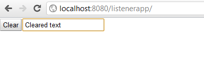

Используем Listener вместо GWT Event Bus
----------------------------------------
* `listenerapp - Alex Tretyakov Blog`: [http://alextretyakov.blogspot.com/2012/01/ispolzuem-listener-vmesto-event-bus.html](http://alextretyakov.blogspot.com/2012/01/ispolzuem-listener-vmesto-event-bus.html)
* `listenerapp - Revision 6: /trunk`: [http://listenerapp.googlecode.com/svn/trunk/](http://listenerapp.googlecode.com/svn/trunk/)
>
>- GWT 2.4.0
>- Maven 3.0.3
>- Tomcat 6.0.33 ([http://localhost:8080/listenerapp/](http://localhost:8080/listenerapp/))

